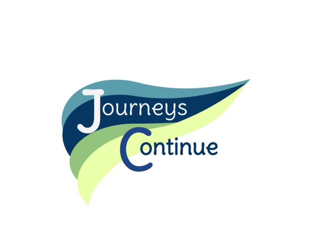

<!-- ! If you can read this comment, please preview this file with a markdown renderer -->

<!--
*** README forked from the Best-README-Template: https://github.com/othneildrew/Best-README-Template
*** Forked by Tim James: https://github.com/Tim-W-James/README-Template
***
*** See the TODO lists for project setup.
*** Find a list of resources for writing markdown, etc. at the end of this file.
-->

<!-- PROJECT LOGO -->
 

   

  <h2 align="center">Journeys Continue Website</h2>

  

    Website for Journeys Continue, an Australian business for social work, disability and aged care services: <a href="https://journeyscontinue.com.au/">https://journeyscontinue.com.au/</a>
     
<!--     <a href="https://github.com/Tim-W-James/Journeys-Continue"><strong>Explore the docs »</strong></a>
      
      -->
<!--     <a href="https://github.com/Tim-W-James/Journeys-Continue">View Demo</a> -->
<!--     ·
    <a href="https://github.com/Tim-W-James/Journeys-Continue/issues">Report Bug</a> -->
<!--     ·
    <a href="https://github.com/Tim-W-James/Journeys-Continue/issues">Request Feature</a> -->
  

<!-- PROJECT SHIELDS -->
<!-- Shields: https://shields.io -->
<!-- Icons: https://github.com/simple-icons/simple-icons/blob/develop/slugs.md -->

 

  <!-- GitHub Actions Shield -->
  <!--  -->
  <!-- Last Commit Shield -->
  
  <!-- Renovate Shield -->
  <!--  -->
  <!-- Release Shield -->
  <!--  -->
  <!-- Contributors Shield -->
  <!--  -->
  <!-- Forks Shield -->
  <!--  -->
  <!-- Stars Shield -->
  <!--  -->
  <!-- Issues Shield -->
  <!--  -->
  <!-- License Shield -->
  <!--  -->
  <!-- Linkedin Shield -->
  <!--  -->

 

<!-- TABLE OF CONTENTS -->

  
Table of Contents

  <ol>
    <li>
      <a href="#about-the-project">About The Project</a>
      <ul>
        <li><a href="#features">Features</a></li>
        <li><a href="#built-with">Built With</a></li>
      </ul>
    </li>
    <li><a href="#contact">Contact</a></li>
    <li><a href="#acknowledgements">Acknowledgements</a></li>
  </ol>

<!-- ABOUT THE PROJECT -->

## About The Project

[![Product Name Screen Shot][product-screenshot]](https://journeyscontinue.com.au/)

Website created for Journeys Continue, an Australian business for social work, disability and aged care services.
Deployed to: [journeyscontinue.com.au/](https://journeyscontinue.com.au/).

### Features

- Define content on a headless CMS (Sanity.io):
  - Create pages with rich text editors
  - Add images, embedded PDFs, and files to be served and optimised by Next js
  - Custom navigation and dynamic page routes
  - Preview draft changes in Sanity Studio
  - ISR (Incremental Static Regeneration) for published changes, without
    requiring a manual rebuild
- Built with Next js for static site generation and integrations with Sanity

View my template containing these features here:
<https://github.com/Tim-W-James/cms-site-builder>

Read this blog to see how I created a CMS site builder:
<https://timjames.dev/blog/creating-a-site-builder-with-nextjs-and-sanity-cms-1e61>

### Built With

- React and Next JS
- Sanity CMS
- TypeScript
- Vercel
- Bootstrap

<!-- CONTACT -->

## Contact

Email: [tim.jameswork9800@gmail.com](mailto:tim.jameswork9800@gmail.com "tim.jameswork9800@gmail.com")

Project Link:
[https://github.com/Tim-W-James/Journeys-Continue](https://github.com/Tim-W-James/Journeys-Continue)

<!-- ACKNOWLEDGEMENTS -->

## Acknowledgements

- CMS schemas adapted from the [NextJS + SanityCMS blog
  starter](https://github.com/sanity-io/nextjs-blog-cms-sanity-v3).

<a href="#top">↑ Back to Top ↑</a>

<!-- MARKDOWN IMAGES -->
<!-- https://www.markdownguide.org/basic-syntax/#reference-style-links -->

[product-screenshot]: images/screenshot.png

<!-- USEFUL LINKS FOR MARKDOWN
* https://github.com/Tim-W-James/blog/blob/master/Markdow-Cheatsheet.md
* https://www.markdownguide.org/basic-syntax
* https://www.webpagefx.com/tools/emoji-cheat-sheet
* https://shields.io
* https://choosealicense.com
* https://pages.github.com
* https://daneden.github.io/animate.css
* https://connoratherton.com/loaders
* https://kenwheeler.github.io/slick
* https://github.com/cferdinandi/smooth-scroll
* http://leafo.net/sticky-kit
* http://jvectormap.com
* https://fontawesome.com -->
